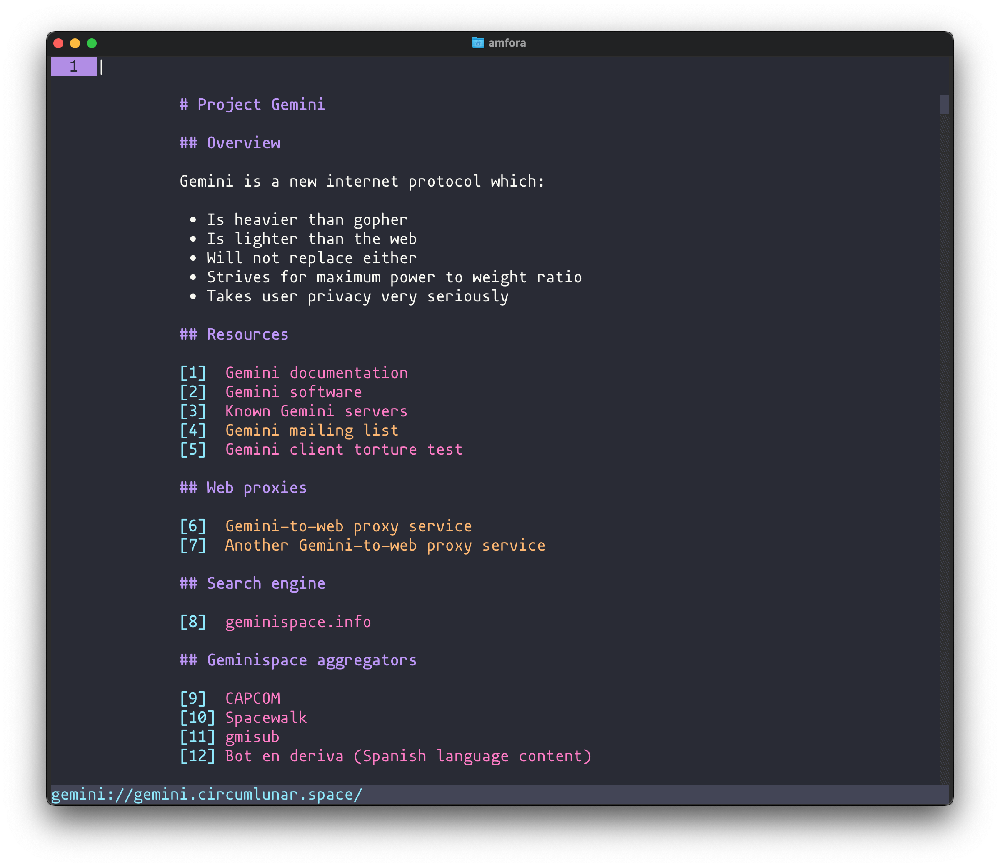

# Dracula for [Amfora](https://github.com/makeworld-the-better-one/amfora)

> A dark theme for [Amfora](https://github.com/makeworld-the-better-one/amfora).

Font used in the example screenshot is [mononoki](https://madmalik.github.io/mononoki/).

## Install

All instructions can be found at [draculatheme.com/amfora](https://draculatheme.com/amfora).

## Team

This theme is maintained by the following person(s) and a bunch of [awesome contributors](https://github.com/dracula/template/graphs/contributors).

 |
--- |
[Marc Ransome](https://github.com/marcransome) |

## License

[MIT License](./LICENSE)
